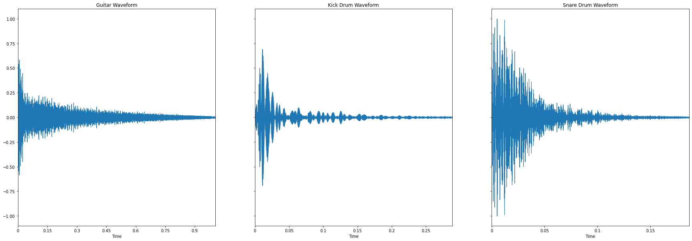

# Learning from Audio

Learning from Audio is a series of Medium articles written by Adam Sabra. Its main objective is to help those in the Data Science/Machine Learning field break into the audio domain starting from the basics of signal processing to more complex topics.

This GitHub repository will host the code and figures used within the articles.

# Links to Articles:
- [Learning from Audio: Wave Forms](https://towardsdatascience.com/learning-from-audio-wave-forms-46fc6f87e016#60b2-e67809770e17)
- Learning from Audio: Fourier Transformation (to be published soon)
