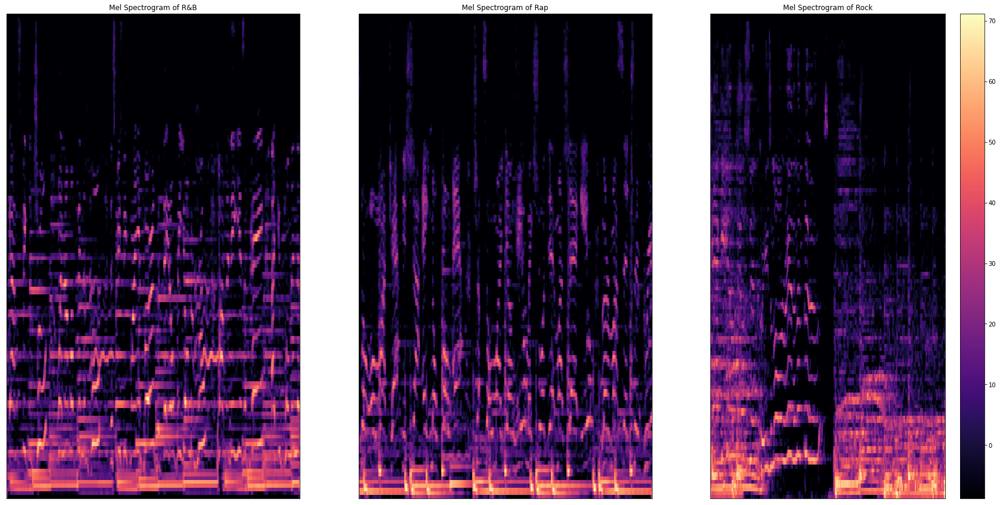

# Learning from Audio

Learning from Audio is a series of Medium articles written by Adam Sabra. Its main objective is to help those in the Data Science/Machine Learning field break into the audio domain starting from the basics of signal processing and build up towards more complex topics.

This GitHub repository will host the code and figures used within the articles.

# Links to Articles:
- [Learning from Audio: Wave Forms](https://towardsdatascience.com/learning-from-audio-wave-forms-46fc6f87e016#60b2-e67809770e17)
- [Learning from Audio: Time Domain Features](https://towardsdatascience.com/learning-from-audio-time-domain-features-4543f3bda34c)
- [Learning from Audio: Fourier Transformation](https://towardsdatascience.com/learning-from-audio-fourier-transformations-f000124675ee)
- [Learning from Audio: Spectrograms](https://towardsdatascience.com/learning-from-audio-spectrograms-37df29dba98c)
- [Learning from Audio: The Mel Scale, Mel Spectrograms, and Mel Frequency Cepstral Coefficients](https://towardsdatascience.com/learning-from-audio-the-mel-scale-mel-spectrograms-and-mel-frequency-cepstral-coefficients-f5752b6324a8)
- [Learning from Audio: Pitch and Chromagrams](https://towardsdatascience.com/learning-from-audio-pitch-and-chromagrams-5158028a505)
# NOTE:
You will find a discrepancy between the Medium articles and the Jupyter notebooks. I highly suggest using the Jupyter notebooks for more consistency. I switched out the studied files from instrument sounds to high resolution snippets of different genres. The published Medium articles still have the old data whereas the Jupyter notebooks have been updated.
